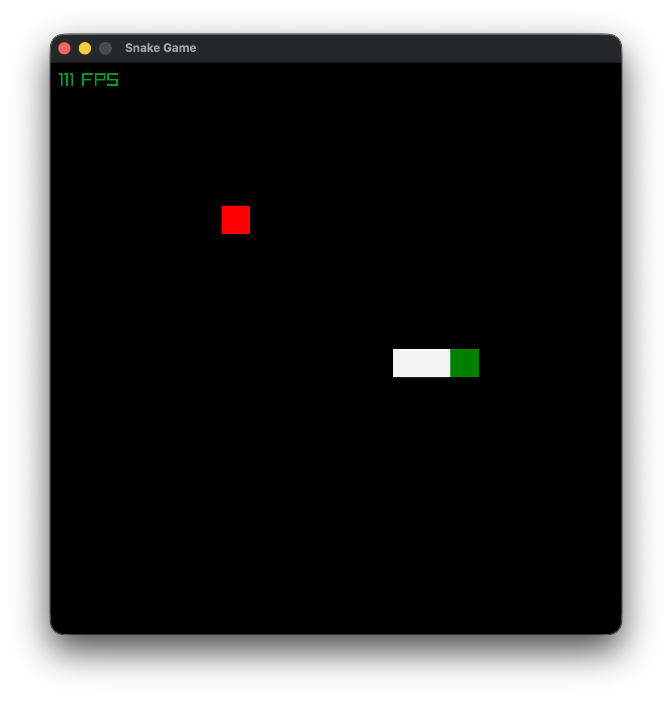
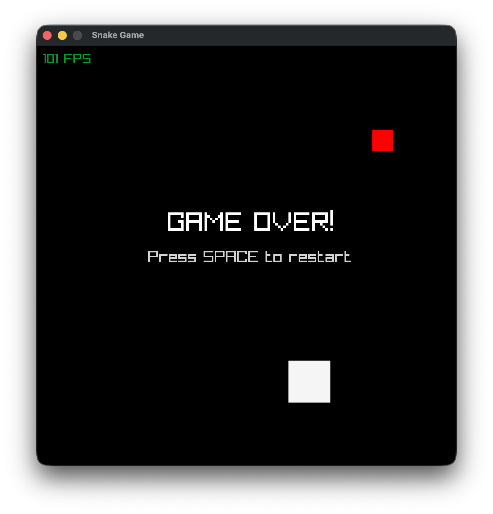

# Snake Game

A classic Snake game built with Rust and Raylib, featuring frame-independent movement and a clean modular architecture.

## Features

- Classic snake gameplay with wrap-around edges
- Frame-independent movement using delta time
- Simple controls using arrow keys
- Snake grows by eating food (red squares)
- Game over on self-collision
- FPS counter for performance monitoring
- Clean, modular code structure following Rust best practices

## Images

| Game                       | Game Over                          |
| -------------------------- | ---------------------------------- |
|  |  |

## Requirements

- Rust (1.70+)
- Raylib dependencies (automatically handled by `raylib-rs`)

## Clone and Run

```bash
# Clone the repository
git clone https://github.com/Abdulkader-Safi/RUST_RAYLIB_SNAKE_GAME.git
cd RUST_RAYLIB_SNAKE_GAME

# Build and run
cargo run --release
```

## Controls

| Key             | Action                      |
| --------------- | --------------------------- |
| Arrow Up / W    | Move up                     |
| Arrow Down / S  | Move down                   |
| Arrow Left / A  | Move left                   |
| Arrow Right / D | Move right                  |
| Space           | Restart game (after losing) |

## Project Structure

```text
src/
├── main.rs              # Application entry point
├── utils.rs             # Utility functions
├── core/
│   ├── mod.rs          # Core module exports
│   ├── constants.rs    # Game configuration constants
│   ├── direction.rs    # Direction enum and logic
│   └── game.rs         # Main game state and loop
└── entities/
    ├── mod.rs          # Entity module exports
    ├── snake.rs        # Snake entity implementation
    └── food.rs         # Food entity implementation
```

## Configuration

You can modify these constants in `src/core/constants.rs`:

```rust
pub const TILE_SIZE: f32 = 32.0;        // Size of each grid cell in pixels
pub const MAP_SIZE: f32 = 20.0;         // Grid dimensions (20x20)
pub const MOVE_INTERVAL: f32 = 0.15;    // Time between moves in seconds
```

## Technical Details

### Frame-Independent Movement

The game uses delta time to ensure consistent movement speed regardless of frame rate:

```rust
let delta_time = rl.get_frame_time();
game.update(delta_time);
```

### Modular Architecture

- **Core Module**: Contains game constants, direction logic, and main game state
- **Entities Module**: Encapsulates game entities (Snake and Food) with their own logic
- **Utils Module**: Provides shared utility functions

This separation ensures clean code organization, easy maintenance, and testability.
